# 👋 Hey, I'm Piyush Borana

### `CSE (IoT) Student` • `AI Developer` • `Full-Stack Developer` • `IoT Builder`

<p align="left">
  
  
</p>

> **I turn ideas into working technology.**

I'm a Computer Science Engineering student specializing in **IoT**, passionate about building products at the intersection of **Artificial Intelligence, Software, Hardware and real-world problem solving**.

I enjoy going from **problem → idea → prototype → product**.

Currently experimenting with AI, IoT, computer vision, full-stack development and hardware-based solutions.

---

# 🚀 About Me

🎓 **B.Tech — Computer Science Engineering (IoT)**

💻 Building **AI-powered applications and full-stack products**

🔌 Developing **IoT & embedded systems using ESP32, Arduino and Raspberry Pi**

🤖 Exploring **Computer Vision, OCR and Edge AI**

🌱 Interested in **AI for Agriculture & Climate Technology**

🏆 Active in **hackathons, innovation challenges and startup competitions**

🧠 Exploring how AI can be combined with hardware to solve practical problems

⚡ I prefer building **real prototypes over just ideas**

---

# 🧩 My Technology Stack

### 👨‍💻 Languages

<p>


</p>

### 🌐 Frontend

<p>


</p>

### ⚙️ Backend

<p>


</p>

### 🗄️ Database & Cloud

<p>


</p>

### 🤖 AI / Data

<p>


</p>

### 🔌 IoT / Embedded

<p>


</p>

### 🛠️ Tools

<p>


</p>

---

# ⭐ Featured Projects

## 🏥 MediVault

### AI-powered digital medical wallet

A platform designed to help users organize and understand their medical documents using **OCR and AI-powered insights**.

**Highlights**

* 📄 Medical document management
* 🔍 OCR-based information extraction
* 🤖 AI-powered insights
* 🌐 Multilingual support
* ☁️ Cloud-based storage

**Tech:** `React` `AI` `OCR` `Supabase`

---

## 💊 AuthentiMed

### AI-powered medicine counterfeit detection

A computer-vision based concept designed to analyze medicine packaging and identify suspicious visual patterns that may indicate counterfeit products.

**Focus areas**

* 👁️ Computer Vision
* 📷 Image analysis
* 🤖 AI-based detection
* 🔍 Product verification

**Tech:** `AI` `Computer Vision` `OCR`

---

## 🌱 SolarMesh

### Smart solar-powered agriculture monitoring

An IoT-based agricultural monitoring system designed to collect environmental and soil data and transmit it through long-range communication.

**System includes**

* 🌱 Soil moisture monitoring
* 🌡️ Temperature monitoring
* 💧 Humidity monitoring
* 📡 LoRa communication
* ☀️ Solar-powered deployment
* 📊 Remote monitoring

**Tech:** `ESP32` `LoRa` `IoT` `Sensors` `Solar Energy`

---

## 🏭 Manufacturing AI

### AI-assisted reverse engineering & manufacturing analysis

An AI-powered concept that helps transform a **product image into manufacturing insights**.

Potential workflow:

`Product Image → AI Analysis → Component Identification → BOM → Manufacturing Process → Feasibility`

**Tech:** `AI` `Computer Vision` `Full Stack`

---

## 🔐 Smart Parcel Locker

An IoT-based parcel management system designed for secure automated package delivery and collection.

**Tech:** `ESP32` `RFID` `IoT` `Sensors`

---

# 🏆 Hackathons & Achievements

### 🥇 Hackathons

* 🏆 **HCL GUVI Hackathon**
* 🏆 **SPIT Hackathon**
* 🏅 **Top 4 — National Hackathon at Amity**
* ⚡ **Google Prompt War**
* 🚀 **AMD Slingshot**
* 🇮🇳 **AI for Bharat Hackathon**

### 📚 Academic & Certifications

* 📄 Research work on **Quantum Computing**
* 🎓 **Google Vertex AI**
* 📊 **Kaggle**
* 💡 Multiple AI / technology projects

---

# 🧠 What I'm Currently Learning

```text
Artificial Intelligence
        ↓
Computer Vision
        ↓
Edge AI
        ↓
IoT + AI
        ↓
Intelligent Hardware
        ↓
Real-World Products
```

Currently focusing on:

* 🤖 AI application development
* 👁️ Computer Vision
* 🔌 Edge AI & IoT
* 🌐 Scalable full-stack systems
* 🧠 AI agents & intelligent workflows
* 🌱 AI for agriculture
* ⚙️ Hardware-software integration

---

# 💡 My Development Philosophy

> **Don't just learn technology. Build something with it.**

I believe the best way to learn is to take a real problem, break it down, build a prototype, test it, fail, improve and repeat.

```text
Problem
   ↓
Research
   ↓
Idea
   ↓
Prototype
   ↓
Testing
   ↓
Iteration
   ↓
Product 🚀
```

---

<h2>📊 GitHub Stats</h2>

<p align="center">
  
  
</p>

# 🔥 Contribution Streak

<p align="center">
  
</p>

---
## 🐍 Contribution Graph

<p align="center">
  
</p>

# 🎯 2026 Goals

* 🚀 Build and ship more production-ready projects
* 🤖 Develop advanced AI + IoT systems
* 🏆 Win more hackathons
* 🌐 Contribute to open-source projects
* 📚 Deepen knowledge in AI & distributed systems
* 💡 Turn promising prototypes into real products
* 🤝 Collaborate with other builders

---

# 🌎 Beyond Code

I enjoy more than just programming.

🎨 **Design & UI/UX**

🎬 **Video Editing**

📈 **Marketing & Product Thinking**

💡 **Startup & Business Ideas**

🎮 **Gaming**

🧪 **Experimenting with new technologies**

---

# 🤝 Let's Build Something

I'm always interested in:

* 🚀 Innovative projects
* 🤖 AI collaborations
* 🔌 IoT & hardware projects
* 🏆 Hackathons
* 🌱 Startup ideas
* 🌐 Open-source contributions

### 📫 Connect With Me

<p>
<a href="YOUR_LINKEDIN_URL">

</a>

<a href="YOUR_PORTFOLIO_URL">

</a>

<a href="mailto:YOUR_EMAIL">

</a>
</p>

---

<p align="center">


### ✍️ Random Dev Quote


---
[](https://visitcount.itsvg.in)

### ⚡ Build → Break → Learn → Repeat → Build Better.

</p>
